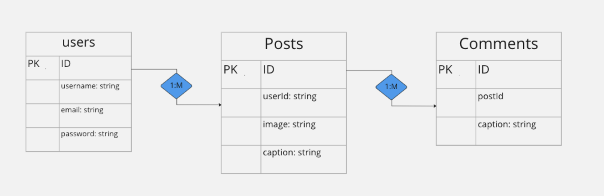
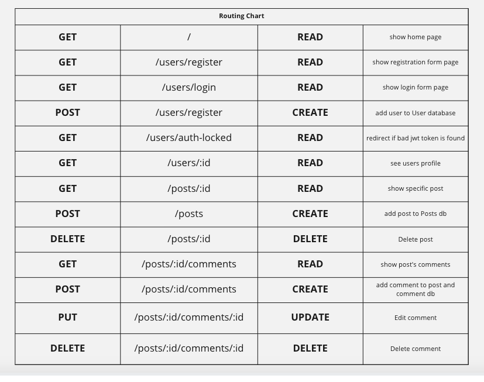

# eciN-Stagram
be Nice!

## Description
eciN-stagram is a social media app mockup of the fourth most popular social media site world-wide, Instagram. This app allows users to upload images with captions on their pages, as well interact with other user's posts, but with a catch. Using a prebuilt machine learning model, Text Toxicity Classifier from Tensorflow.js, this site prevents users from commenting toxic content (threatening language, insults, obscenities, identity-based hate, or sexually explicit language). 

## Technologies
- JavaScript
- PostgreSQL
- Express
- Reactjs
- Nodejs
- TensorFlow.js
- HTML/CSS

## ERD

## Routing Chart

## User Stories
- As a user, I would like to make posts of captioned images, and view all of my posts.
- As a user, I would like to delete posts.
- As a user, I would like to view other's posts.
- As a user, I would like to create comments on posts.
- As a user, I would like to edit comments on posts.
- As a user, I would like all comments that are created and edited to disallow any toxic content.

## MVP
- Create, Read  posts on my profile
- See other users and read their posts
- Create, Read, Delete comments.
- Do not allow users to post toxic comments.

## Stretch Goals
- Implement likes on posts.
- Report button for mean comments that get through.
- EVENTUALLY: Time posted, video upload, stories, follow/unfollow, instagram feed.

## Sprints
- Day 1- backend
- Day 2 and 3 (Weekend)- separate pages 
    -Two people -Home, register/login, and Profile  
    -Two people -specific post(comments)
- Day 4 - finish, debug, and review weekend work
- Day 5 - Hopefully stretch goals/CSS
- Day 6 - Hopefully stretch goals/CSS
- Day 7 - Hopefully stretch goals/CSS

## Team Members
- Paul Kim
- Daniel Park
- Theo Robinson
- Derek Hale
